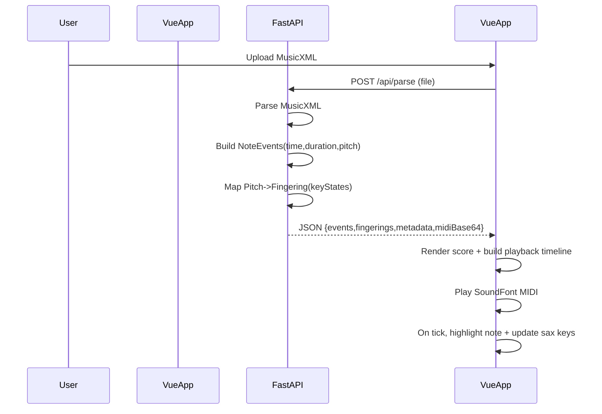

# MusicXML-to-AltoSax Fingering Visualizer

Build a Python backend that parses MusicXML into timed note events + alto-sax fingering states, and a Vue frontend that renders the score, animates an alto sax fingering diagram, and plays back audio via an in-browser SoundFont synth.

## Architecture (MVP)

- **Backend (Python/FastAPI)**: Accept MusicXML upload, parse it, normalize to concert pitch & tempo, output a timed event stream and fingering states for alto sax.
- **Frontend (Vue)**: Render the sheet music, play audio in-browser (SoundFont/WebAudio), and drive a sax fingering visualization synced to the playback cursor.

## Key Technical Choices

- **Score rendering**: Use `opensheetmusicdisplay` in Vue to display the MusicXML and provide a cursor.
- **Timing model**: Backend returns events with **absolute time offsets** (seconds) computed from MusicXML tempo + durations; frontend uses this for both audio scheduling and fingering animation.
- **Playback**: Backend produces a MIDI (or MIDI-like event list); frontend plays it using WebAudio SoundFont (e.g., `soundfont-player` or a Tone.js-compatible SoundFont loader).
- **Fingering model**: Define a canonical set of alto sax "keys" (e.g., octave, LH1-3, RH1-3, sideKeys, palmKeys, lowC#/B/Bb, bisBb, etc.) and map each written pitch to a boolean key-state vector.

## Implementation Status

✅ **Backend Parse Endpoint**: FastAPI backend with `/api/parse` to accept MusicXML and return timed events + midiBase64 + metadata

✅ **Fingering Mapping**: Alto sax fingering mapping (written pitch -> key states) with initial supported range and accidentals

✅ **Frontend Score Viewer**: Vue UI with OpenSheetMusicDisplay to render MusicXML and provide a cursor

✅ **Frontend Audio Playback**: In-browser SoundFont playback and a timeline controller synced to backend events

✅ **Frontend Fingering Visualization**: SVG alto sax fingering component driven from key-state timeline

## Implementation Details

### 1. Backend Skeleton

- Created `backend/` with FastAPI app, CORS, and `POST /api/parse`.
- Parse MusicXML using `music21` (or equivalent) into a single monophonic line for MVP.
- Produces:
  - `metadata`: tempo, time signature, transpose info
  - `events`: list of `{t0,durSec,midiNote,spelling}`
  - `fingerings`: list of `{eventIndex,keyStates}`
  - `midiBase64`: a small MIDI file for frontend playback

### 2. Alto Sax Transposition + Pitch Normalization

- Ensure written vs sounding pitch is handled correctly for **E♭ alto sax**.
- The visualization shows **written fingerings** (recommended) and keeps the audio consistent with that (SoundFont instrument in concert pitch but using transposed MIDI as needed).

### 3. Fingering Mapping Module

- `backend/app/sax/fingering_alto.py` with:
  - `KeyId` enum (all keys in the diagram)
  - `Fingering` dataclass `{pressed: set[KeyId], altName?: str}`
  - `pitch_to_fingering(midiNote, spelling) -> Fingering`
- Supports core range (e.g., written low Bb to high F#) and expandable.

### 4. Frontend App (Vue)

- `frontend/` Vue app with:
  - Upload component
  - Score viewer (OSMD) with cursor
  - Sax fingering component: SVG-based alto sax diagram driven by `keyStates`
  - Transport controls: play/pause/seek/tempo

### 5. Sync Engine (Single Source of Truth)

- Timeline controller in Vue:
  - schedules audio playback
  - updates the highlighted note and fingering state based on current time
- Ensures the cursor and fingerings stay aligned on pause/seek.

### 6. Polish + Robustness

- Handle rests and ties (merge tied notes into one sustained event).
- Handle multiple voices by selecting the top staff/voice (MVP) and add a warning if polyphonic.
- Add basic error reporting (invalid MusicXML, unsupported range).

## Project Structure

### Backend Files

- `backend/app/main.py` - FastAPI application entry point
- `backend/app/api/parse.py` - API endpoint for MusicXML parsing
- `backend/app/musicxml/parse.py` - MusicXML parsing logic
- `backend/app/sax/fingering_alto.py` - Alto sax fingering mapping

### Frontend Files

- `frontend/src/main.ts` - Vue application entry point
- `frontend/src/components/ScoreViewer.vue` - Score rendering component
- `frontend/src/components/SaxFingering.vue` - Sax fingering visualization
- `frontend/src/lib/timeline.ts` - Timeline controller for sync

## MVP Acceptance Criteria

- ✅ Upload a MusicXML melody.
- ✅ Sheet music renders in the browser.
- ✅ Press Play: audio plays via SoundFont, current note highlights, and sax fingering diagram updates in sync.
- ✅ Works for a reasonable alto range and common accidentals.
